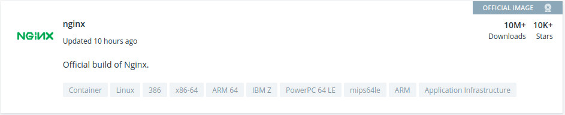
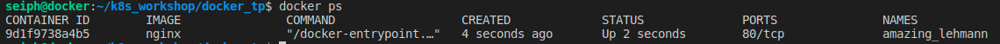

# Introduction à Docker

## 1.Installation
Connectez-vous à votre VM et procédez à l'installation de docker avec les commandes ci-dessous:

```bash
sudo apt-get update
sudo apt-get install -y docker.io
```

Afin de pouvoir utiliser Docker sans élévation de privilège (sudo), coller la commande ci-dessous:

```bash
sudo setfacl -m user:$USER:rw /var/run/docker.sock
```

Puis vérifiez votre installation avec le traditionnel 'Hello world'

```bash
docker run hello-world
```

## 2.Lancement de son premier conteneur

Téléchargez une image nginx depuis [docker-hub](https://hub.docker.com), qui référence toutes les images publiques proposées pour docker.
Pour des questions de sécurité, il est toujours conseillé de 'pull' en priorité les images officielles.



Pour télécharger l'image, sans la lancer, faites la commande suivante:

```bash
docker pull nginx
```

Vous devriez désormais avoir 2 images, si vous lancez la commande:

```bash
docker images
```
## 3.Lancez votre première image
Pour lancer le serveur Nginx, vous devez lancer la commande suivante:

```bash
docker run -d nginx
```
*-d permet de détacher le process, comme pourrait le faire le symbôle **&** dans le shell *

Vous devriez désormais voir apparaitre votre conteneur en tapant la commande:

```bash
docker ps
```


Remarquez le nom du conteneur créé tout à droite (ici amazing_lehmann)

Pour supprimer le conteneur vous avez désormais le choix, vous pouvez le supprimer en tapant son nom (amazing_lehmann dans mon cas) ou via le container ID via cette commande:

```bash
docker rm -f amazing_lehmann
```
**ou**

```bash
docker rm -f 9d1f9738a4b5
```

## 4.Accéder au contenu du conteneur
Maintenant que vous avez lancer votre conteneur nginx, vous voudriez surement pouvoir accéder à la page web, pour celà, rien de plus simple:
<span style="color:red">Attention !</span> bien que vous voyez le port 80 affiché lors de l'affichage des processus docker, il ne s'agit en réalité que du port du conteneur, et celui-ci n'est pas accessible avec l'adresse "localhost", pour cela nous allons faire un pont entre le port du conteneur et le port de notre machine.

Pour faire cela, nous allons utiliser l'argument **-p** qui signifie **port**

```bash
docker run -d -p 8080:80 nginx-
```
A noter que dans notre exemple ci-dessus, nous demandons a docker de transférer le port 80 du **conteneur** au port 8080 de **notre machine**, vous pouvez donc accéder à cette page via:

http://localhost:8080 


## 5.Personnaliser le contenu de notre conteneur
Enfin, nous allons personnaliser la page web, pour cela nous allons ajouter le paramètre **-v** (pour **volume**) et y ajouter la page présente dans ce TP en donnant le chemin absolu vers le fichier ou dossier en question

```bash
docker run --name nginxperso2 -d -p 80:80 -v /home/$USER/k8s_workshop/docker_tp/demo/index.html:/usr/share/nginx/html/index.html:ro nginx
```
*A noter qu'ici nous avons ajouté l'argument **--name** qui permet de définir soi-même le nom du container* 


C'est ici que se termine le 1er TP, comme vous pouvez le voir, les commandes sont relativement simple, dans le but de pouvoir automatiser, nous verrons comment créer des **Dockerfile** afin de pouvoir automatiser la création de container.