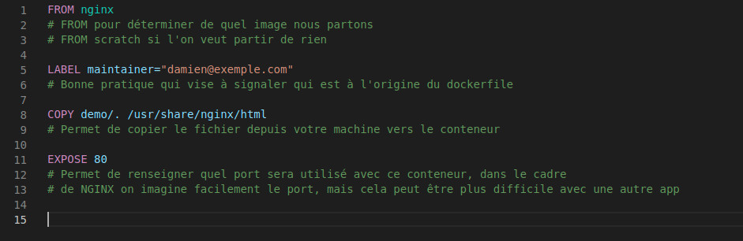
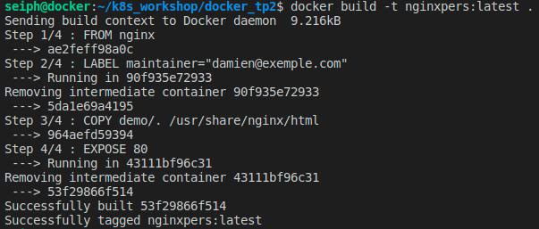

# Introduction à Docker - Dockerfile

## 1.Le Dockerfile



Voici ainsi le dockerfile correspondant à notre dernière étape du TP précédent

## 2. Build notre dockerfile

```bash
docker build -t nginx2:latest .
```
Ici, l'argument **-t** signifie tag et permet de donner un nom à votre image et le point signifie de chercher le fichier dockerfile dans le répertoire courant

*A noter qu'un Dockerfile n'est pas une image, mais un template permettant de générer une image*

Vous devriez avoir un résultat comme l'image ci-dessous:


Une fois le build terminé, vous devriez retrouver l'image à l'aide de la commande:

```bash
docker images
```
## 3.Lancer le conteneur
A présent, prenez le nom de votre image et lancer la même commande que d'habitude à savoir:

```bash
docker run -d -p 80:80 nginx2
```

Vous pouvez vérifier que désormais votre conteneur fonctionne avec la mini-page html correspondante.


Dans le 3ème TP, nous aborderons les volumes dans Docker
